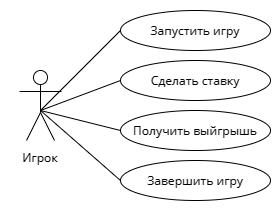

# Лабораторая работа №1 #
**Проект: 1. Игра Рулетка**
Диаграмма вариантов использования (use-case)

---
## Прецедент "Запуск игры"
**Описание**: Игрок начинает новую игру, указывая свое количество денег и тип рулетки (Европейская / Американская).
- **Основной исполнитель**: Игрок
- **Предусловие**: Приложение готово к запуску.

### Основной успешный сценарий:
| Игрок                                              | Система                                    | 
|-----------------------------------------------------------|--------------------------------------------|
| 1. Игрок запускает приложение.                            |                                            | 
| 2. Игрок вводит количество денег (от 100 до 10 000) и тип рулетки | 	                                          |	
|                                                           | 3. Создается игра с указанными параметрами |
---

## Прецедент "Сделать ставку"
**Описание**: Игрок делает ставку.
- **Основной исполнитель**: Игрок
- **Предусловие**: Игра запущена с указанными параметрами (кол-во денег, тип рулетки)
- **Постусловие**: Колесо рулетки запущено.
  
### Основной успешный сценарий:
| Игрок                                              | Система                                    | 
|-----------------------------------------------------------|--------------------------------------------|
| 1. Выбирает тип ставки и размещает фишки на соответствующем поле стола.                           |
| 2. Подтверждает ставку                        | |
||	3.Проверяет допустимость ставки в соответствии с правилами выбранного вида улетки.|	 
|| 3. Регистрирует ставку и обновляет информацию об игровом столе.|
|| 4. Запускает колесо рулетки|

Альтернативные сценарии:
2а. Если ставка недопустима (например, неверное количество фишек), система отображает сообщение об ошибке и предлагает повторить ставку.

---

## Прецедент "Получить выйгрыш"
**Описание**: Расчитываем выйгрышь игрока.
- **Основной исполнитель**: Система
- **Предусловие**: Рулетка завершила вращение и шарик упал на определенное число.
- **Постусловие**: Выигрыш игрока определен и отображен.
### Основной успешный сценарий:
| Игрок                                              | Система                                    | 
|-----------------------------------------------------------|--------------------------------------------|
||1.Определяет номер и цвет отделения, в которое упал шарик.|
| |2. сопоставляет результат с размещенными ставками игрока и вычисляет выигрыш в соответствии с правилами выбранного вида рулетки.| 
||	3.Система обновляет информацию об игровом счете игрока|	 

Альтернативные сценарии:
1а.Если шарик упал на зеро, система применяет специальные правила для американской и европейской рулетки.

---

## Прецедент "Завершение игры"
**Описание**: Игра завершается при 0 счете игрока или действия "Покинуть игру".
- **Основной исполнитель**: Система.
- **Предусловие**: Игра находится в активном состоянии.
- **Постусловие**:  Игра завершена, и результаты отображены игроку.
### Основной успешный сценарий:
| Игрок                                              | Система                                    | 
|-----------------------------------------------------------|--------------------------------------------|
||1.Определяет, что условие завершения игры выполнено.|
| |2. Рассчитывает итоговые результаты игры, такие как выигрыш и проигрыш участника.| 
||	3. Завершает игру и переносит на главный экран.|	 

Альтернативный сценарий:
1а. Игрок принял решение о завершении игры.
